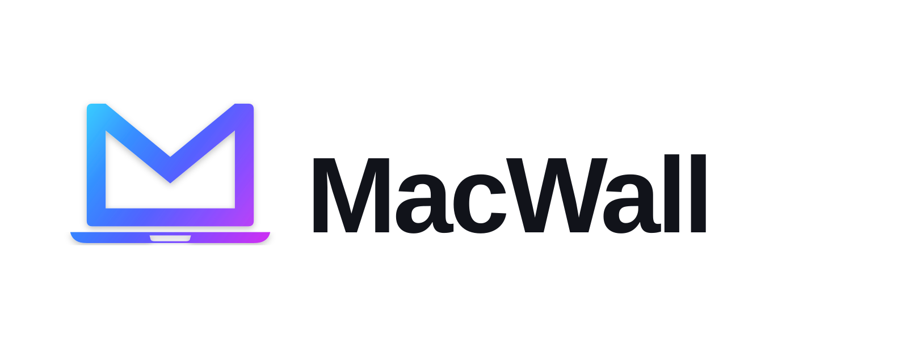

<p align="center">
  <picture>
    <source media="(prefers-color-scheme: dark)" srcset="logo/primary-logo/macwall-primary-on-dark.svg">
    <source media="(prefers-color-scheme: light)" srcset="logo/primary-logo/macwall-primary-on-light.svg">
    
  </picture>
</p>

Use your own Wallpaper Engine Workshop projects on macOS.

MacWall is for people who already bought Wallpaper Engine on Windows and copied their local Workshop folder to a Mac. It scans that copied folder, imports supported wallpapers into a private Mac library, and plays video, web, image, and supported scene wallpapers on the desktop layer.

[한국어 README](README.ko.md)

## Quick Start

1. On Windows, find your Wallpaper Engine Workshop folder:

   ```text
   C:\Program Files (x86)\Steam\steamapps\workshop\content\431960
   ```

2. Copy the `431960` folder to your Mac.
3. Download `MacWall-macOS-arm64.dmg` from the latest GitHub release.
4. Open the DMG, drag **MacWall.app** to **Applications**, then open it.
5. Click the menu bar icon, then choose **Open Settings**.
6. For Wallpaper Engine projects, click **Browse**, choose the copied `431960` folder, then click **Scan**.
7. Select a supported project and click **Import Selected**.
8. For your own video, click **Add Video File** instead.
9. Select the imported project or video and click **Play on Desktop**.
10. Choose **Display**:
    - **Fit** keeps the full wallpaper visible and may show letterboxing.
    - **Fill** covers the screen like Wallpaper Engine's cover-style modes and may crop the edges.
    - **Stretch** fills the screen exactly and may distort the image.
11. Use **Remove** to delete an imported item from the Mac library without touching the original copied folder or video.

The app runs as a menu bar utility. It does not stay in the Dock or app switcher, and the settings window can be closed while animated wallpapers continue running on the desktop layer.

To animate the Lock Screen, turn on **Animate Lock Screen**, click **Screen Saver Settings**, and select **MacWall** as the macOS screen saver. macOS runs Lock Screen animation through the screen saver system, so MP4, MOV, and M4V wallpapers animate there. Other wallpaper types use a still fallback image.

## Playback Behavior

- **Auto-pause behind apps** is enabled by default.
- Minimizing or hiding the MacWall control window does not stop playback.
- Closing the settings window does not quit the app. Use **Quit** from the menu bar icon when you want to fully stop the background utility.
- When another app covers the desktop, the wallpaper layer stays in place. Standalone videos pause on their current frame. Web wallpapers pause CSS animations but keep embedded videos running to avoid a visible resume delay.
- When you return to the desktop, playback resumes automatically.
- After sleep/wake or monitor changes, the app recreates the wallpaper windows and resumes the selected wallpaper.
- You can disable auto-pause from the menu bar icon or the settings window if you want continuous playback.
- Turn on **Open at Login** if you want the menu bar utility to start automatically after logging in. The last played wallpaper is restored on app launch unless you press **Stop Playback** first.
- Use **Remove** in the imported library list to delete copied Mac-library files you no longer want.

To reduce flashes of the previous macOS wallpaper during Spaces and full-screen transitions, the app keeps a per-item `Derived/desktop-fallback.png`. Play/Apply starts the live desktop layer first. If the fallback already exists, the app then applies it as the macOS system wallpaper. When it is absent, Video, Image, and Web items generate it asynchronously from the real source or rendered Web output. Web snapshot failure does not stop live playback. Workshop previews and Scene thumbnails are never used as desktop fallback cache sources. Use the library item's menu commands **Show in Finder**, **Generate Desktop Fallback**, and **Regenerate Desktop Fallback** to inspect or rebuild the cache manually. When **Restore on Stop** is enabled, static image wallpapers are copied to `Application Support/MacWall/DesktopWallpaperRestore/Originals` before the app applies a fallback, and **Stop Playback** restores that copy only while the current macOS wallpaper is still the app-applied fallback. MacWall `desktop-fallback.png` files are not captured as original wallpapers. macOS built-in or dynamic wallpapers such as `Macintosh` cannot be restored reliably through public APIs, so the app warns and skips automatic restore for those sessions. After a different item successfully applies its new fallback, the previous item's `desktop-fallback.png` is deleted. **Stop Playback** preserves the current item's cache for later reuse.

## Performance Snapshot

Measured on an Apple M2 Mac running macOS 26.2 with a local MP4 wallpaper:

- Launch-to-process average: 69.8 ms across 5 cold opens.
- Playback sample: 2.35% average CPU and 107.1 MB average RSS over 20 seconds.
- Video still-frame extraction: 231.7 ms average across 5 runs.
- Current local library scan: 466 ms.

## Lock Screen And Still Wallpaper

MacWall supports Lock Screen animation through a bundled macOS screen saver. Apple exposes a public `ScreenSaverView` framework for custom screen savers, and macOS Lock Screen settings can start the selected screen saver when the Mac is inactive or locked.

What the app can animate:

- MP4, MOV, and M4V video wallpapers selected in your Mac library.
- Your own videos added with **Add Video File**.

What uses a still fallback:

- WebM, MKV, and AVI until you convert them to MP4.
- Web wallpapers.
- Scene wallpapers use a static Workshop preview on the desktop by default. Experimental 2D image-layer rendering can be enabled separately. The Lock Screen screen saver also uses a still fallback for scene projects.

How to enable it:

1. Open **MacWall Settings**.
2. Turn on **Animate Lock Screen**.
3. Click **Screen Saver Settings**.
4. Choose **MacWall** as the macOS screen saver.
5. In macOS Lock Screen settings, set when the screen saver starts and when a password is required.

This app does not patch Apple's Aerial wallpaper database or use private Lock Screen wallpaper databases.

What the app can do safely:

- Set a still image as the macOS desktop wallpaper.
- For MP4, MOV, and M4V video wallpapers, extract a still frame from the video instead of using a tiny Workshop preview GIF.
- Write the same still image to the current user's macOS Lock Screen cache when that cache is available.

Use **Set Still Wallpaper** on an imported project. Direct-play video projects use a generated frame from the video file; WebM, MKV, and AVI projects must be converted first. Image and scene projects use a still preview when one exists. If macOS has already cached a Lock Screen image, the visible Lock Screen may update after locking, logging out, or the next wallpaper refresh.

## Supported Projects

| Project type | Support |
| --- | --- |
| `.mp4`, `.mov`, `.m4v` video | Plays directly |
| `.webm`, `.mkv`, `.avi` video | Convert with local `ffmpeg`, then play |
| `index.html` web wallpaper | Plays locally in a restricted WebView; optional Web Mouse Interaction |
| `.jpg`, `.png`, `.gif`, `.heic` image | Displays as a static desktop layer |
| `scene.pkg` scene wallpaper | Displays a static preview by default; optional experimental 2D renderer |

You can also add your own local video with **Add Video File**. MP4, MOV, and M4V play directly. WebM, MKV, and AVI are imported first, then converted locally with `ffmpeg`. Converted wallpaper videos are stored as H.264 MP4 files without an audio track because desktop playback is muted.

Workshop preview files such as `preview.jpg`, `thumbnail.jpg`, or `cover.png` are normally treated as thumbnails. Scene projects use their preview as a static desktop-layer placeholder by default so unsupported runtime features do not produce broken layouts. These preview files are never used as `Derived/desktop-fallback.png` system-wallpaper cache sources.

Web wallpapers ignore mouse input by default so normal desktop clicks continue to work. Enable **Web Mouse Interaction** while using wallpapers with clickable controls, then turn it off to restore normal desktop clicks.

Experimental scene rendering is intentionally conservative. It can decode some packed `.tex` textures, LZ4 blocks, common DXT formats, and basic position, scale, rotation, and opacity keyframes. Advanced Wallpaper Engine runtime features such as particles, audio-reactive scripts, custom shaders, text layers, media integration, and video/GIF texture animation may be skipped or look different.

## What This App Will Not Do

MacWall is local-only.

- It does not download Steam Workshop items.
- It does not bypass Steam authentication.
- It does not bypass DRM.
- It does not emulate Steam protocols.
- It does not claim full `scene.pkg` runtime compatibility.
- It does not upload, share, or redistribute creator assets.
- It does not modify your original copied Workshop folder.

## Development Docs And Contributing

- Docs index: [docs/README.md](docs/README.md)
- Development roadmap: [docs/development-roadmap.md](docs/development-roadmap.md)
- Contributing guide: [CONTRIBUTING.md](CONTRIBUTING.md)
- License: [LICENSE](LICENSE)

Imported files are copied into:

```text
~/Library/Application Support/MacWall
```

## Install From Source

Requirements:

- macOS 14 or newer
- Xcode command line tools
- Swift 6 toolchain
- Optional: `ffmpeg` for WebM/MKV/AVI conversion

```bash
git clone https://github.com/mingyu1715/MacWall.git
cd MacWall
swift run MacWall
```

Install `ffmpeg`:

```bash
brew install ffmpeg
```

## Build A Local App Bundle

```bash
bash Scripts/package-app.sh
open "dist/MacWall.app"
```

The script creates:

```text
dist/MacWall-macOS-arm64.dmg
```

## Developer ID Signing And Notarization

Unsigned local builds are useful for development, but public GitHub releases should use Apple Developer ID signing and notarization so users do not see the unidentified-developer warning.

Prerequisites:

- Apple Developer Program membership
- A `Developer ID Application` certificate installed in Keychain
- A saved notary profile, for example:

```bash
xcrun notarytool store-credentials "macwall-notary" \
  --apple-id "APPLE_ID_EMAIL" \
  --team-id "TEAM_ID" \
  --password "APP_SPECIFIC_PASSWORD"
```

Build, sign, notarize, and staple the DMG:

```bash
SIGN_IDENTITY="Developer ID Application: NAME (TEAM_ID)" \
NOTARY_PROFILE="macwall-notary" \
REQUIRE_SIGNING=1 \
bash Scripts/package-app.sh
```

The script signs the bundled executables, signs the app, creates the DMG, signs the DMG, submits it with `notarytool`, staples the accepted ticket, and verifies the final DMG with `spctl`.

## CLI

`macwallctl` is included for advanced users and testing.

```bash
swift run macwallctl scan "/path/to/431960" --out index.json
swift run macwallctl import "/path/to/431960"
swift run macwallctl import-video "/path/to/video.mp4"
swift run macwallctl remove "<asset-id>"
swift run macwallctl convert input.webm --out output.mp4
swift run macwallctl scene-info "/path/to/scene.pkg"
swift run macwallctl scene-render-info "/path/to/scene.pkg"
swift run macwallctl doctor
```

Use `scene-info` first when a scene looks static. It reports animation, particle, effect, and shader counts without decoding large textures. `scene-render-info` decodes supported textures and can take longer on high-resolution scene packages.

## Troubleshooting

If nothing appears on the desktop:

- Check that the imported project is marked `playable`.
- Press **Stop**, then **Play on Desktop** again.
- Temporarily turn off **Auto-pause behind apps**.
- Make sure you are looking at the desktop, not a full-screen app Space.

If the wallpaper looks blurry or cropped:

- Choose **Fit** to keep the full image/video visible.
- Choose **Fill** if you want the screen fully covered and accept edge cropping.
- Check whether Experimental Scene Rendering is enabled. Scene projects use a static preview by default because particles, scripts, custom shader effects, and animated texture features may differ from Wallpaper Engine.

If WebM/MKV/AVI conversion fails:

```bash
brew install ffmpeg
```

If macOS warns that the app is from an unidentified developer, that means the release is not notarized yet. You can still build from source with Swift.

## Relationship To Wallpaper Engine

This project is not affiliated with Valve, Steam, or Wallpaper Engine. Wallpaper Engine is a trademark of its respective owner. MacWall is a compatibility tool for personal local use with files you already have lawful access to.

## License

MIT. Original project notice and current maintainer notice are recorded in [LICENSE](LICENSE).
